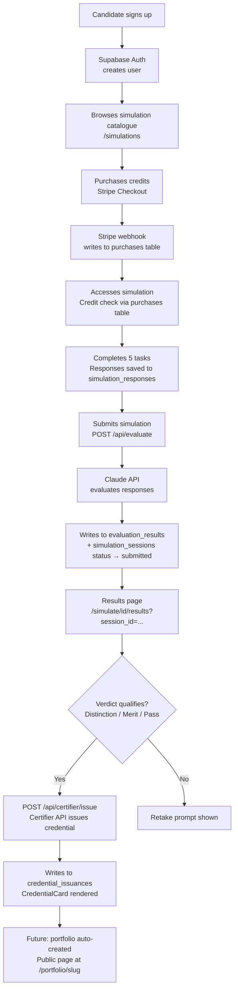

# Architecture

_Last updated: 25 April 2026_

---

## 1. What this system does

Career Bridge Foundation runs scenario-based professional simulations. Candidates complete multi-task assessments, receive an AI-generated evaluation and verdict band, and can claim a verifiable digital credential. A public portfolio page (Phase 1, in development) will let candidates share their results.

---

## 2. Tech stack

| Layer | Technology | Version |
|---|---|---|
| Framework | Next.js (App Router) | 16.2.3 |
| UI library | React | 19.2.4 |
| Language | TypeScript | ^5 |
| Styling | Tailwind CSS | ^4 |
| Database + Auth + Storage | Supabase (`@supabase/supabase-js`, `@supabase/ssr`) | ^2.103.3 / ^0.10.2 |
| AI evaluation + chat | Anthropic Claude API (`@anthropic-ai/sdk`) | ^0.90.0 |
| Payments | Stripe (`stripe`, `@stripe/stripe-js`) | ^22.0.2 / ^9.2.0 |
| Digital credentials | Certifier.io (REST API, no SDK) | — |
| Fonts | Inter (Google Fonts) | — |
| Icons | lucide-react | ^1.8.0 |
| Hosting | Vercel | — |

---

## 3. Folder structure

```
/
├── app/                    # Next.js App Router — pages and API routes
│   ├── api/                # Server-side API route handlers
│   │   ├── certifier/      # Digital credential issuance
│   │   ├── chat/           # In-simulation AI assistant
│   │   ├── evaluate/       # Simulation evaluation via Claude
│   │   ├── purchases/      # Credit consumption
│   │   └── stripe/         # Checkout creation and webhook handling
│   ├── auth/               # Login, signup, reset-password, OAuth callback
│   ├── for-coaches/        # Coach landing page
│   ├── payment/            # Post-payment success page
│   ├── pricing/            # Pricing and plan selection
│   ├── simulate/           # Simulation execution ([id]) and results ([id]/results)
│   └── simulations/        # Simulation catalogue and discipline browse
├── components/
│   ├── home/               # Landing page sections (Hero, HowItWorks, Partners, etc.)
│   ├── layout/             # Header and Footer (used across all pages)
│   ├── simulation/         # Simulation UI (sidebars, task prompt, response form, chat)
│   └── ui/                 # Generic UI primitives
├── constants/              # Shared constants (brand colours)
├── docs/                   # Project documentation (this folder)
├── hooks/                  # Custom React hooks (useSimulation, useEvaluation, useChat)
├── lib/                    # Utility modules
│   ├── supabase/           # Supabase browser and server client factories
│   ├── access-control.ts   # Credit-check logic for simulation access
│   ├── certifier.ts        # Client-side fetch wrapper for credential issuance
│   ├── cn.ts               # Tailwind class merging utility
│   ├── disciplines-data.ts # Discipline metadata for catalogue
│   ├── pricing.ts          # Pricing plan definitions
│   ├── rate-limit.ts       # In-memory rate limiter for API routes
│   ├── simulation-prompts.ts # Task prompts, simulation brief, evaluation criteria
│   └── simulations-data.ts # Simulation catalogue data
├── middleware.ts            # Next.js middleware — Supabase session refresh on every request
├── public/                 # Static assets (logo, favicon, SVGs)
├── supabase/
│   ├── email-templates/    # Custom Supabase auth email HTML
│   └── migrations/         # SQL migration files (source of truth for DB schema)
├── types/
│   ├── database.ts         # TypeScript types for all Supabase tables
│   └── index.ts            # Shared application types (Prompt, StepResponse, etc.)
└── .env.example            # Environment variable template
```

---

## 4. External services

| Service | Role |
|---|---|
| **Supabase** | PostgreSQL database, authentication (email/password + OAuth), row-level security, file storage |
| **Anthropic Claude** | Powers the simulation chat assistant and evaluation engine |
| **Stripe** | Handles payment checkout sessions and webhook-based credit provisioning |
| **Certifier.io** | Issues verifiable digital credentials after a qualifying evaluation result |
| **Vercel** | Hosting, edge middleware, environment variables, preview deployments |
| **Google Fonts** | Inter font loaded via `<link>` in root layout |

### 4.1 Brand colours

| Name | Hex |
|---|---|
| Primary navy | `#003359` |
| Secondary blue | `#006FAD` |
| Teal accent | `#4DC5D2` |

---

## 5. Data flow



---

## 6. Authentication model

- Supabase email/password auth
- OAuth providers configured: Google, LinkedIn
- Session managed via HTTP-only cookies using `@supabase/ssr`
- `middleware.ts` runs on every request to refresh the session token
- Two Supabase clients in use:
  - `lib/supabase/client.ts` — browser client (used in client components and hooks)
  - `lib/supabase/server.ts` — server client (used in API routes and server components)
- API routes that touch sensitive data (evaluation results, credential issuances, purchases) use a **Supabase admin client** constructed with `SUPABASE_SERVICE_ROLE_KEY` to bypass RLS where needed

---

## 7. Rate limiting

`lib/rate-limit.ts` provides an in-memory sliding-window rate limiter applied to `/api/chat` and `/api/evaluate`. It is per-IP, resets on server restart, and is not shared across Vercel instances. Suitable for MVP volumes; would need a Redis-backed solution at scale.

---

## 8. Deployment and branch model

| Branch | Environment | URL |
|---|---|---|
| `landing-page` | Production (current) | `career-bridge-foundation-project.vercel.app` |
| `main` | Secondary / legacy | Not currently deployed |
| Feature branches | Preview per PR | Vercel preview URL |

- The team intends to migrate production to `main` as the deployment source in a future sprint. Until that migration, all production deploys come from `landing-page`.
- Repository: `Career-Bridge-Foundation/career-bridge-foundation-project` on GitHub. Default branch: `landing-page`.
- Vercel auto-deploys on push to any branch
- Environment variables are set per environment in the Vercel dashboard
- Build command: `next build --webpack` (verified from `package.json`)
- No test suite is currently configured

---

## 9. Current simulation

One simulation is live in production: **Product Strategy** (Nexus Bank, Financial Services, Associate Product Manager role). The simulation catalogue at `/simulations/page.tsx` displays 14 simulation cards across the Product Management discipline; only Product Strategy currently has full content and an active task page. Other simulations show coming-soon states. The simulation content for Product Strategy is hardcoded in `lib/simulation-prompts.ts`. Multi-simulation routing exists (`/simulate/[id]`) but content parameterisation per ID is a future step.

---

## 10. Key design constraints

- **No test suite.** TypeScript type-checking (`npx tsc --noEmit`) is the primary correctness check.
- **Single simulation content.** `lib/simulation-prompts.ts` is a flat file, not a database-backed CMS.
- **Rate limiter is in-memory.** Not shared across serverless function instances.
- **Certifier URL construction.** Certifier's API does not return a `url` field directly; the credential URL is constructed from `publicId` as `https://credsverse.com/credentials/{publicId}`.
- **Phase 1 portfolio-evidence storage bucket (pending) will be public;** documented in [`/docs/CareerBridge_Portfolio_Phase1_Spec.md`](./CareerBridge_Portfolio_Phase1_Spec.md) section 3.2.

---

_See [DATABASE.md](./DATABASE.md) for full schema. See [API_ROUTES.md](./API_ROUTES.md) for route reference. See [INTEGRATIONS.md](./INTEGRATIONS.md) for external service details._
